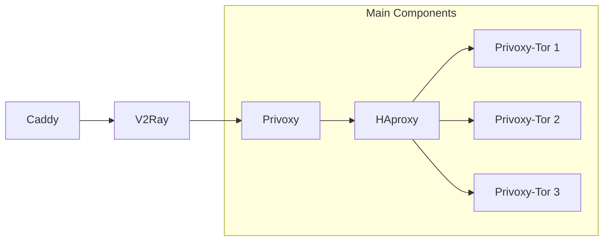

# 🧅 HAproxyTorsObfs4

### 🍽️ Your private onion tunnel to the Internet.

## 🌐 Language / Язык

- 🇬🇧 English
- 🇷🇺 [Русский](README.md)

## 📋 Description

**HAproxyTorsObfs4** is a solution for routing traffic through the Tor network using multiple parallel Tor instances, each configured with obfuscated bridges (obfs4). The project is implemented as a set of Docker containers managed via Docker Compose. It is designed to provide private access to the Tor network both from a local network (via Privoxy) and from external sources (via V2Ray), with traffic load balancing across the Tor instances.

### 💪 Features:

- **Runs multiple Tor instances** with obfuscation support (obfs4)
- **Traffic load balancing** via **HAProxy**
- Supports connections:

  - from the **local network** via **Privoxy** (HTTP)
  - from the **external network** via **V2Ray** (VMess + WebSocket + TLS, proxied through Caddy)
- **Automatic bridge updates**:

  - adding new ones
  - availability checks
  - removal of non-working bridges
- **Minimal maintenance** after initial setup

A system diagram is provided below.



## 📦 Dependencies

- [Docker](https://docs.docker.com/engine/install/)

## 🛠️ Installation

1. Install [Docker](https://docs.docker.com/engine/install/) if it's not already installed.
2. Clone the repository:

```bash
git clone https://github.com/quietcow1/HAproxyTorsObfs4.git
cd HAproxyTorsObfs4
```

3. Run the setup script:

```bash
./setup.sh
```

During the script execution:

- It will ask how many Tor instances you want to run (default is 3).
- It will offer to install V2Ray:
  - A random UUID will be generated for the client during installation.
  - You can either keep the default UUID or enter your own.
- It will offer to install a reverse proxy (Caddy) for routing traffic to V2Ray:
  - During installation, you will need to specify a domain name that will be used for connecting to V2Ray via the VMess protocol (through WebSocket + TLS).

At the end, the script will offer to automatically run:

```bash
docker compose up -d --build
```

You can either agree or run this command manually later.

📌 Note:
If you plan to use it only on a local network, there's no need to install V2Ray and Caddy.
Simply leave the default value (3 Tor instances) and start the containers with the following command:

```bash
docker compose up -d.
```

To access from an external network, you need to install V2Ray and Caddy (unless you're using another reverse proxy). Additionally, make sure you have:

- A static public IP — the preferred option (provided by your ISP for an additional fee),

 — or —
- A dynamic public IP — also possible, but requires DynDNS setup and open ports (usually closed by default).

If you're behind a NAT (i.e. you have a private IP), external access is not possible.

You will also need to configure port forwarding for ports 80 and 443 on your router, unless these ports are blocked by your ISP. Since routers may vary, it is recommended to check the online documentation for your specific model.

For obtaining a domain name, you can use free services such as [duckdns.org](https://www.duckdns.org), which also support dynamic IP updates (DynDNS).

## 🔌 Connection

Depending on the configuration, the connection can be established in two ways:

1. **From the local network** — via Privoxy (HTTP).
2. **From the external network** — via V2Ray (VMess + WebSocket + TLS), proxied through Caddy.

Instructions for each connection method are provided below.

### 1. From the Local Network

#### Connecting to Privoxy

##### iOS / iPadOS (without third-party apps)

1. Open **Settings → Wi-Fi**.
2. Tap the `i` icon next to your connected Wi-Fi network.
3. Scroll down to the **HTTP Proxy** section.
4. Select **Manual**.
5. In the **Server** field, enter the IP address of your server.
6. In the **Port** field, enter `8118`.
7. Leave **Authentication** turned off.
8. Go back — the settings will be saved automatically.

##### Apple TV

To connect to an HTTP proxy on Apple TV, a third-party app is required — **Shadowrocket**.

1. Install [Shadowrocket](https://apps.apple.com/us/app/shadowrocket/id932747118) (available in the App Store, paid).
2. Open the app and tap the `+` button in the top right corner.
3. In the **Type** field, select `HTTP`.
4. In the **Address** field, enter your server's IP address.
5. In the **Port** field, enter `8118`.
6. You can leave the other settings as default.
7. Save the configuration.
8. On the main screen, select the added server under **Local Servers**.
9. Tap the **"Off"** button to activate the connection.

##### Android

1. Open **Settings** on your Android device.  
2. Go to **Network & Internet** → **Wi-Fi**.  
3. Tap the ⚙️ icon next to your connected Wi-Fi network.  
4. Scroll down and select **Proxy** → **Manual**.  
5. In the **Hostname** field, enter your server's IP address.  
6. In the **Port** field, enter `8118`.  
7. Save the settings by going back.

##### Android TV

нет настроек???? (((

### 2. From external network

##### Windows / Linux

1. Download and install [Nekoray](https://en.nekoray.org/download/).
2. Launch the application.
3. Go to the **Profiles** tab.
4. Click the **New Profile** button.
5. Fill in the fields as follows:
   - **Type**: `Vmess`
   - **Name**: any name you like (e.g., `My Server`)
   - **Address**: `domain_name.org`
   - **Port**: `443`
   - **UUID**: paste the generated UUID
   - **Network**: `ws`
   - **Security**: `tls`
   - **Path**: `/v2ray`
6. Leave the other fields unchanged.
7. Click **OK** to save the profile.
8. Return to the main window.
9. Check the box next to **System Proxy**.
10. Right-click on the created profile and select **Start**.

**Note:**  
If you didn't copy the UUID during the setup process, you can retrieve it from the configuration file inside the V2Ray container:

```bash
docker exec -it v2ray cat /etc/v2ray/config.json | grep '"id"'
```

Nekoray supports the Russian language and is available for Windows and Linux.  
Another popular cross-platform application (including support for macOS) is [v2rayN](https://en.v2rayn.org/download/).  
It doesn't include Russian localization out of the box, but it offers advanced features.

##### iOS / iPadOS / Apple TV:
Рекомендуемое приложение — [Shadowrocket](https://apps.apple.com/us/app/shadowrocket/id932747118) *(платное)*.
Если вы знаете бесплатную альтернативу — пожалуйста, сообщите.

##### Android / Android TV:
Рекомендуемое бесплатное приложение — [v2rayNG](https://en.v2rayng.org/).
Скачайте последнюю версию на [GitHub](https://github.com/2dust/v2rayNG) или через альтернативные маркеты.

### Примеры конфигураций

## ⚙️ Конфигурация

## Примеры
