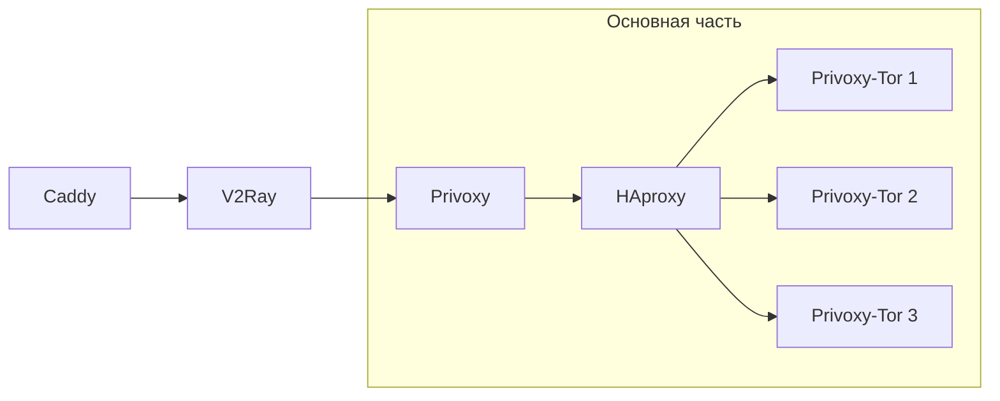

# 🧅 «Я каждый день запускаю v2ray-haproxy-tor-obfs4, пока Роскомнадзор не сдастся»

## 🌐 Язык / Language

- Русский (по умолчанию - текущий файл)
- [English](README-EN.md)

## 📑 Оглавление

- [📋 Описание](#-описание)
- [📦 Зависимости](#-зависимости)
- [🛠️ Установка через скрипт](#️-установка-через-скрипт)
- [🔌 Подключение](#-подключение)
  - [Privoxy (HTTP)](#1-подключение-к-privoxy-http)
  - [V2Ray (VMess + WebSocket + TLS)](#2-подключение-к-v2ray-vmess--websocket--tls-с-проксированием-через-caddy)
- [⚙️ Конфигурация](#️-конфигурация)
  - [🔄 Автообновление мостов](#-проверка-и-автообновление-мостов-obfs4)
  - [🧩 Получение новых мостов](#-получение-новых-мостов-obfs4)
- [🙏 Поддержка проекта](#-поддержка-проекта)


## 📋 Описание

**v2ray-haproxy-tor-obfs4** — это решение для маршрутизации трафика через сеть Tor с использованием нескольких параллельных экземпляров Tor, каждый из которых работает через обфусцированные мосты (obfs4). Проект реализован в виде набора Docker-контейнеров, управляемых через Docker Compose. Предназначен для обеспечения приватного выхода в сеть Tor как из локальной сети (Privoxy, V2Ray), так и из внешней сети (V2ray), с балансировкой трафика между экземплярами Tor.

### 💪 Особенности:

- **Запуск нескольких экземпляров Tor** с поддержкой обфускации (obfs4)
- **Балансировка трафика** через **HAproxy**
- Подключение возможно через:

  - **V2Ray** (VMess + WebSocket + TLS, с проксированием через Caddy)
  - **Privoxy** (HTTP)
- **Автоматическое обновление мостов**

  - добавление новых
  - проверка доступности
  - удаление неработающих
- **Минимальное вмешательство** после первоначальной настройки

Схема представлена ниже.



## 📦 Зависимости

- [Docker](https://docs.docker.com/engine/install/)

## 🛠️ Установка через скрипт

1. Установите [Docker](https://docs.docker.com/engine/install/), если он еще не установлен.
2. Клонируйте репозиторий:

```bash
git clone https://github.com/quietcow1/v2ray-haproxy-tor-obfs4.git
cd v2ray-haproxy-tor-obfs4
```

3. Запустите скрипт настройки:

```bash
./setup.sh
```

В процессе выполнения скрипт:

- Спросит, сколько экземпляров Tor вы хотите запустить (по умолчанию — 3).
- Предложит установить V2Ray:
  - Вы можете ввести свой UUID или сгенерировать новый.
- Предложит установить обратный прокси (Caddy) для маршрутизации трафика на V2Ray:
  - При установке потребуется указать доменное имя, которое будет использоваться для подключения к V2Ray по протоколу VMess (через WebSocket + TLS).

В конце скрипт предложит автоматически запустить:

```bash
docker compose up -d --build
```

Вы можете согласиться или выполнить эту команду вручную позже.

📌 Примечание:
Если вы планируете использовать только в локальной сети, устанавливать V2Ray и Caddy не требуется.
Достаточно оставить значение по умолчанию - 3 экземпляра Tor - и запустить контейнеры с помощью команды:

```bash
docker compose up -d
```

⚠️ **Важно:** Чтобы обеспечить доступ из внешней сети, необходимо:

1. Установить **V2Ray** и **Caddy** (если не используется другой обратный прокси).
2. Убедиться, что у вас **белый IP-адрес**.
3. Настроить проброс портов **80** и **443** на маршрутизаторе.

  🔧 Поскольку модели маршрутизаторов различаются, рекомендуется ознакомиться с инструкцией для вашей модели — найдите её в Интернете.

4. Получить **доменное имя**.

  🌐 Можно использовать бесплатные сервисы, например [duckdns.org](https://www.duckdns.org).

## 🔌 Подключение

В зависимости от конфигурации, подключение может осуществляться через:

1. V2Ray (VMess + WebSocket + TLS) с проксированием через Caddy
2. Privoxy (HTTP) только из локальной сети.

📌 Примечание:
Из локальной сети также можно подключиться через V2Ray. В этом случае необходимо настроить на маршрутизаторе статический DNS, который будет перенаправлять на Caddy на порту 443

Ниже приведены инструкции для каждого варианта подключения.

### 1. Подключение к Privoxy (HTTP)
##### Firefox / Google Chrome

1. Откройте **Настройки**.
2. Перейдите в раздел **Основные** → **Настройки сети**.
3. Нажмите кнопку **Настроить...**.
4. Выберите **Ручная настройка прокси**.
5. В поле **HTTP-прокси** укажите IP-адрес вашего сервера.
6. В поле **Порт** введите `8118`.
7. Поставьте галочку **Также использовать этот прокси для HTTPS**.
8. Сохраните изменения.


##### iOS / iPadOS (без сторонних приложений)

1. Откройте **Настройки → Wi-Fi**.
2. Нажмите на значок `i` рядом с вашей Wi-Fi сетью.
3. Пролистайте вниз до раздела **Прокси HTTP**.
4. Выберите **Вручную**.
5. В поле **Сервер** введите IP-адрес вашего сервера.
6. В поле **Порт** укажите `8118`.
7. Оставьте **Аутентификацию** выключенной.
8. Вернитесь назад — настройки сохраняются автоматически.

##### Android

1. Откройте **Настройки** на вашем Android-устройстве.
2. Перейдите в раздел **Сеть и Интернет** → **Wi-Fi**.
3. Нажмите на значок ⚙️ рядом с вашей подключённой Wi-Fi сетью.
4. Пролистайте вниз и выберите **Прокси-сервер** → **Вручную**.
5. В поле **Имя хоста** укажите IP-адрес сервера.
6. В поле **Порт** укажите `8118`.
7. Сохраните настройки, вернувшись назад.

##### Android TV / Apple TV

Для подключения к HTTP-прокси на Android TV / Apple TV потребуется стороннее приложение.

1. Скачайте и установите для Android TV или Apple TV [Shadowrocket](https://apps.apple.com/us/app/shadowrocket/id932747118) (доступно в App Store, платное).
2. Откройте приложение и нажмите на `+` в правом верхнем углу.
3. В поле **Тип** выберите `HTTP`.
4. В поле **Адрес** введите IP-адрес сервера.
5. В поле **Порт** укажите `8118`.
6. Остальные параметры можно оставить по умолчанию.
7. Сохраните конфигурацию.
8. На главном экране выберите добавленный сервер в разделе **Локальные серверы**.
9. Нажмите кнопку **"Выключено"**, чтобы активировать подключение.

### 2. Подключение к V2Ray (VMess + WebSocket + TLS) с проксированием через Caddy

##### Windows / Linux

1. Скачайте и установите [Nekoray](https://en.nekoray.org/download/).
2. Запустите приложение.
3. Перейдите во вкладку **Профили**.
4. Нажмите кнопку **Новый профиль**.
5. Заполните поля следующим образом:
   - **Тип**: `Vmess`
   - **Имя**: любое на ваш выбор (например, `Мой сервер`)
   - **Адрес**: `domain_name.org`
   - **Порт**: `443`
   - **UUID**: вставьте полученный UUID
   - **Сеть**: `ws`
   - **Безопасность**: `tls`
   - **Path**: `/v2ray`
6. Остальные параметры оставьте без изменений.
7. Нажмите **ОК** для сохранения профиля.
8. Вернитесь в главное окно приложения.
9. Установите галочку напротив **Системный прокси** или **Режим TUN**.
10. Кликните правой кнопкой мыши по созданному профилю и выберите **Запустить**.

📌 Примечание:
В случае, если вы не скопировали UUID во время настройки, его можно получить из конфигурационного файла внутри контейнера V2Ray:

```bash
docker exec -it v2ray cat /etc/v2ray/config.json | grep id
```

Nekoray поддерживает русский язык и программа доступна для Windows и Linux.
Другой популярной кроссплатформенной программой (включая поддержку macOS) является [v2rayN](https://en.v2rayn.org/download/).

##### iOS / iPadOS / Apple TV:

1. Скачайте и установите приложение [Shadowrocket](https://apps.apple.com/us/app/shadowrocket/id932747118) *(платное)*.
2. Нажмите на кнопку **+** в правом верхнем углу.
3. Заполните поля следующим образом:

   - **Тип**: `Vmess`
   - **Адрес**: `domain_name.org`
   - **Порт**: `443`
   - **UUID**: вставьте полученный UUID
   - **Транспорт**: `websocket`
     - **Путь**: `/v2ray`
   - **TLS**: `Включено`
   - **UDP-переадресация**: `Включено`
4. Остальные настройки оставьте по умолчанию.
5. Сохраните профиль.
6. Выберите созданный сервер в разделе **Локальные серверы**.
7. Активируйте подключение, передвинув ползунок сверху.

##### Android / Android TV:

1. Скачайте и установите приложение [v2rayNG](https://en.v2rayng.org/). Версия [GitHub](https://github.com/2dust/v2rayNG).
2. Нажмите на кнопку **+** в правом верхнем углу.
3. Заполните поля следующим образом:

   - **Тип**: `Vmess`
   - **Адрес**: `domain_name.org`
   - **Порт**: `443`
   - **UUID**: вставьте полученный UUID
   - **Транспорт**: `websocket`
     - **Путь**: `/v2ray`
   - **TLS**: `Включено`
   - **UDP-переадресация**: `Включено`
4. Остальные настройки оставьте по умолчанию.
5. Сохраните профиль.
6. Выберите созданный сервер в разделе **Локальные серверы**.
7. Активируйте подключение, передвинув ползунок сверху.

## ⚙️ Конфигурация

### 🔄 Проверка и автообновление мостов Obfs4

По умолчанию:

- Файл со списком мостов располагается по пути `./tor/bridges/bridges.json` на хосте или `/bridges/bridges.json` внутри контейнеров.
- Добавление новых мостов осуществляется с помощью скрипта `new_bridges.sh`:
  - при запуске с хоста — через `./tor/new_bridges.sh`;
  - из контейнера — через `/bridges/new_bridges.sh`.
- Проверка доступности мостов выполняется скриптом `check_bridges.sh`:
  - с хоста — через `./tor/check_bridges.sh`;
  - из контейнера — через `/bridges/check_bridges.sh`.

Обновление выполняется автоматически каждый день в **03:00** контейнером `tor1`, который отвечает за:

- добавление новых мостов;
- проверку текущих;
- удаление недоступных мостов, если они не отвечали более **3 раз подряд** (на 4-й день мост удаляется).

В **04:00** происходит автоматический перезапуск всех контейнеров Tor.
Между перезапусками `tor1`, `tor2`, `tor3` предусмотрена **задержка в 3 минуты** для сохранения стабильного интернет-соединения.

⚠️ **Важно:** хотя бы один мост должен оставаться рабочим.
 В противном случае провайдер может заблокировать подключение к сети Tor, и получение новых мостов станет невозможным.
 При запуске скриптов с хоста убедитесь, что есть активное подключение к сети Tor.

### 🧩 Получение новых мостов Obfs4

Если все текущие мосты оказались заблокированы, вы можете получить новые одним из следующих способов:

- 🌐 Через официальный сайт Tor:  
  [https://bridges.torproject.org/bridges?transport=obfs4](https://bridges.torproject.org/bridges?transport=obfs4)

- 📧 По электронной почте:  
  Отправьте письмо на адрес `bridges@torproject.org`.  
  - **Тема письма:** оставьте пустой  
  - **Текст сообщения:**  
    ```
    get transport obfs4
    ```
  ⚠️ Используйте почтовый адрес от **Gmail** или **Riseup**, иначе запрос может быть отклонён.

- 🤖 Через Telegram-бота:  
  [@GetBridgesBot](https://t.me/GetBridgesBot)

## 🙏 Поддержка проекта

Если вам нравится этот проект и вы хотите поддержать его развитие, вы можете отправить криптовалюту на один из адресов ниже:

### 💰 Bitcoin (BTC)

bc1q752hy7v8tff00uqsksdlzn6uf03yktdup3x799


### 💎 Ethereum (ETH)

0x3f11aa78f33a1b12f334604d2C7B3B8Bd7B8dC92


Спасибо за вашу поддержку! ❤️
